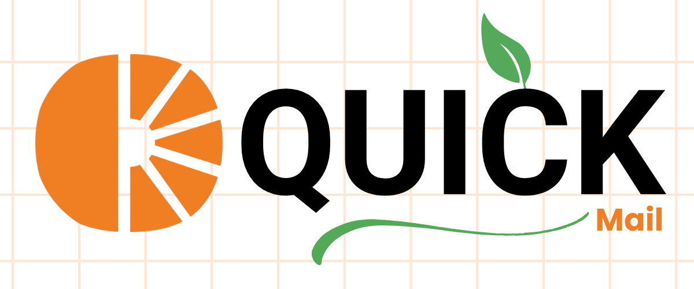
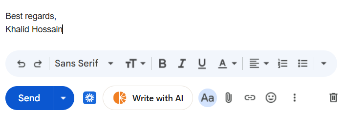
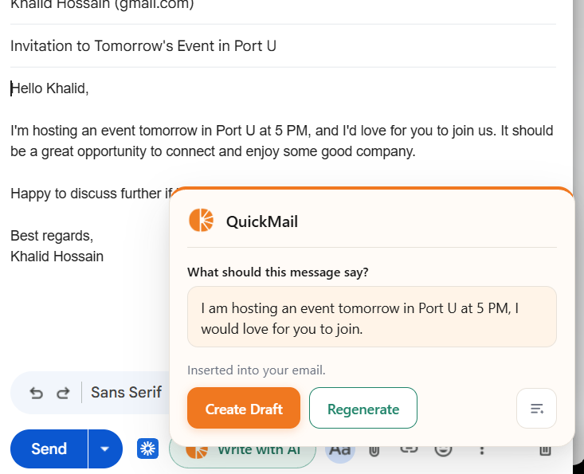
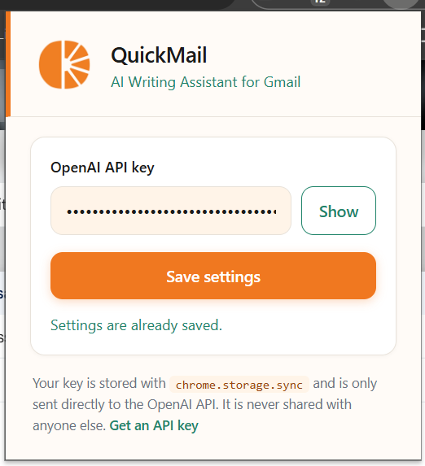
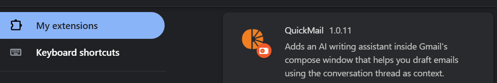

# QuickMail

**QuickMail** is a Chrome extension that adds an AI writing assistant directly inside Gmail's compose window. Tell it what you want to say and it drafts a polished email using the thread, your recipients, and your account name, with a greeting, clear body, and sign-off. For new messages, you can optionally generate a subject line without overwriting one you have already written. Your OpenAI API key is stored in Chrome and sent only to OpenAI, with no backend server.

<p align="center">
  
  <br>
  <b>Figure 1: QuickMail Preview Design</b>
</p>

## Project Overview

QuickMail lives where you already write email. Click **Write with AI** next to **Send**, describe what you want to say, and get a full draft inserted into your compose window without leaving Gmail.

The extension reads the open thread so replies stay on topic, picks up recipient and sender names from the compose window, and formats each draft with a greeting, body, and sign-off. On new messages, you can toggle subject-line generation on or off before you generate.

- **Draft in place** from any compose or reply window
- **Thread-aware replies** using the subject and recent messages
- **Create Draft** or **Regenerate** for a fresh take on the same prompt
- **Optional subject lines** for new emails, with a toggle to protect what you have already written
- **One-time API key setup** in the toolbar popup

<p align="center">
  
  <br>
  <b>Figure 2: Write with AI button injected next to Send in the Gmail compose toolbar.</b>
</p>

## Features

QuickMail is built to produce drafts that feel personal and fit naturally into Gmail. GPT-4o is guided to match the thread's tone, use real names in greetings and sign-offs, and avoid generic AI filler. The popover stays anchored to the compose toolbar as you scroll, and your API key is stored locally and sent only to OpenAI.

Standout capabilities:

- **Smart name detection** from the To field and your Gmail account
- **Reply vs. new compose** handled differently, including when subject lines are generated
- **Subject toggle** in the popover for new messages
- **Minimal permissions** for Gmail, OpenAI, and local storage only

<p align="center">
  
  <br>
  <b>Figure 3: AI popover with instruction input, subject toggle, and Create Draft / Regenerate actions.</b>
</p>

## Technologies Used

| Technology | Purpose |
|---|---|
| Chrome Extension (Manifest V3) | Injects QuickMail into Gmail and runs the settings popup |
| JavaScript | Extension logic, Gmail integration, and OpenAI requests |
| OpenAI GPT-4o | Generates email drafts from your prompt and thread context |
| chrome.storage.sync | Saves your API key across signed-in Chrome profiles |
| HTML & CSS | Settings popup and in-Gmail UI styling |

QuickMail runs entirely inside Chrome and Gmail, so there is nothing extra to host or deploy. GPT-4o handles the writing, Chrome storage keeps setup to a single saved API key, and the content script brings the assistant straight into the compose window where you already work.

<p align="center">
  
  <br>
  <b>Figure 4: Extension settings popup for saving your OpenAI API key.</b>
</p>

## How to Use

1. **Load the Extension in Chrome**:
   - Clone or download this repository:
     ```bash
     git clone https://github.com/KhalidHossainGitHub/QuickMail.git
     cd QuickMail
     ```
   - Open Chrome and go to **`chrome://extensions`**.
   - Enable **Developer mode** (top right).
   - Click **Load unpacked** and select the `QuickMail` folder.

2. **Add Your OpenAI API Key**:
   - Click the **QuickMail** icon in the Chrome toolbar.
   - Paste your [OpenAI API key](https://platform.openai.com/api-keys) and click **Save settings**.
   - Your key is stored locally in Chrome and sent only to `api.openai.com`.

3. **Draft an Email in Gmail**:
   - Open [Gmail](https://mail.google.com) and start a **new message** or **Reply**.
   - In the compose toolbar, click **Write with AI** (next to **Send**).
   - Type what you want the email to say in the instruction field.
   - For new compose, use the subject icon on the right to turn **Subject Generation** ON or OFF.
   - Click **Create Draft** to generate and insert the text into the compose body.
   - Click **Regenerate** if you want a new version from the same instruction.

4. **Review Before Sending**:
   - Always read and edit the draft before clicking **Send**. QuickMail assists with writing, but you remain responsible for the final message.

<p align="center">
  
  <br>
  <b>Figure 5: Chrome Extensions page featuring QuickMail.</b>
</p>

## License

MIT
